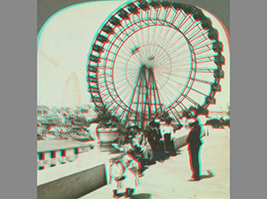
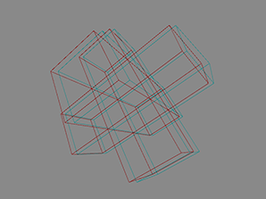
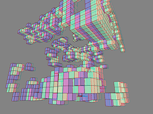

Scam (Stereo Camera)
====================

A few boilerplate projects to get started with anaglyph stero-pair rendering in Processing.

1. Simple stereo camera example 
   

2. Stereo camera example with common renderer   
   

3. Shader example to combine stereoscopic pictures
   

Anaglyph (etymology)
--------------------

From Ancient Greek ἀναγλυφή (anagluphḗ, “work in low relief”); from ana- up + glyphein carve out

Noun
Anaglyph (plural anaglyphs)

1. A decorative ornament worked in low relief or bas relief, such as a piece of cameo jewelry.

2. A matched pair of images designed to produce a three-dimensional effect when viewed using spectacles that have usually one red and one bluish-green lens, corresponding to the colors of the pairs of images.

Resources
---------

The examples shown here are a mere assemblage of work done by others:

* [http://paulbourke.net/stereographics/stereorender](http://paulbourke.net/stereographics/stereorender) 
  Calculating Stereo Pairs

* [http://www.3dtv.at/knowhow/anaglyphcomparison_en.aspx](http://www.3dtv.at/knowhow/anaglyphcomparison_en.aspx) 
  Anaglyph Methods Comparison

* [http://www.animesh.me/2011/05/rendering-3d-anaglyph-in-opengl.html](http://www.animesh.me/2011/05/rendering-3d-anaglyph-in-opengl.html) 
  Rendering anaglyph in OpenGL

* [https://vimeo.com/62505109](https://vimeo.com/62505109) 
  A Processing example with more resources in the comment area
